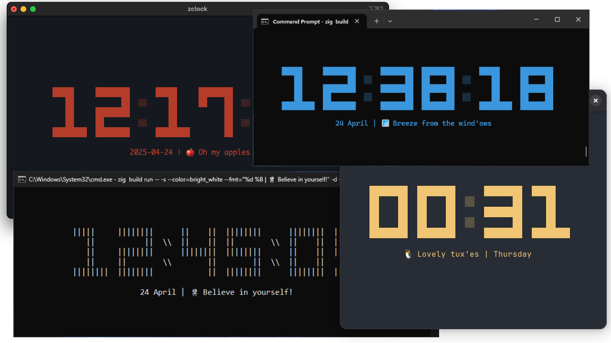

# zclock

A minimal customizable cross-platform terminal digital clock.

zclock is written from scratch in [zig](https://ziglang.org/) and only uses `time.h` and pure zig std.

* Works on windows, macos and linux
* Auto center or manual position in terminal
* Custom date string formatting
* Toggle seconds display
* Toggle between 12 or 24 hour (military) mode
* Change colors to personalize it
* Change clock render style

## Install

1. Install latest zig master branch.
2. Clone this repository.
   ```bash
   git clone https://github.com/tr1ckydev/zclock
   cd zclock
   ```
3. Build the project.
   ```bash
   zig build -Doptimize=ReleaseFast
   ```
4. Add the binary file from `./zig-out/bin/` to `$PATH`.

> Press `Ctrl + C` to exit to clock.

## Usage

Print the help menu to see the available options.

```bash
zclock --help
```

* `--fmt=<FORMAT>`: See [strftime manual](https://www.man7.org/linux/man-pages/man3/strftime.3.html#DESCRIPTION) for available format specifiers.
* `--color=<NAME>`: See [zig docs](https://ziglang.org/documentation/master/std/#std.io.tty.Color) for valid color names.
* `--style=<STYLE>`: `default` | `line`

## Notes on windows

When using Windows Terminal or Windows Console Host, sometimes flickering of the clock can be observed when it redraws itself on the terminal after each second.

Switch to unix-like terminals such as MinGW terminal (e.g. Git Bash), Cygwin terminal for a flicker-free experience.

## Credits

Thanks to [peaclock](https://github.com/octobanana/peaclock) for inspiring this project.

## License

This repository is licensed under the MIT License. Please see [LICENSE](https://github.com/tr1ckydev/zclock/blob/main/LICENSE) for full license text.
